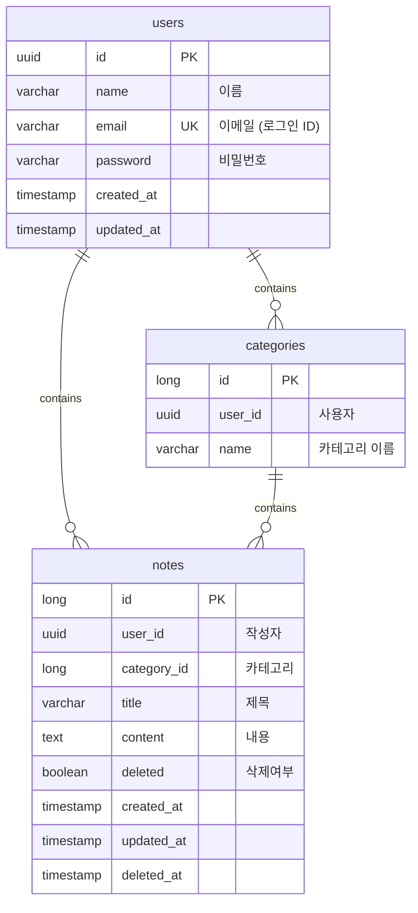

# 설계문서
- 노트 생성 및 카테고리 관리에 대한 설계 문서
## ERD

```mermaid
erDiagram
    users {
        uuid id PK
        varchar name "이름"
        varchar email UK "이메일 (로그인 ID)"
        varchar password "비밀번호"
        timestamp created_at
        timestamp updated_at
    }

    notes {
        long id PK
        uuid user_id "작성자"
        long category_id "카테고리"
        varchar title "제목"
        text content "내용"
        boolean deleted "삭제여부"
        timestamp created_at
        timestamp updated_at
        timestamp deleted_at
    }

    categories {
        long id PK
        uuid user_id "사용자"
        varchar name "카테고리 이름"
    }

    users ||--o{ categories: "contains"
    users ||--o{ notes: "contains"
    categories ||--o{ notes: "contains"
```
## 패키지 구조

