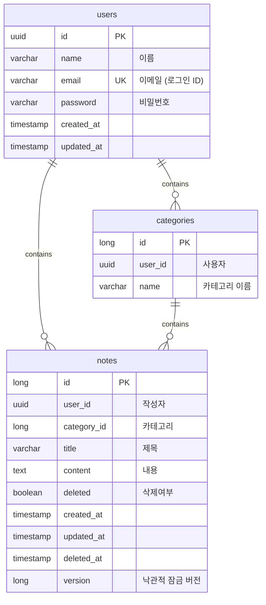

# 설계문서

- 노트 생성 및 카테고리 관리에 대한 설계 문서

## ERD



## 낙관적 잠금 (Optimistic Locking)

노트 수정 시 동시 편집 충돌을 감지하기 위해 version 기반 낙관적 잠금을 사용한다.

- `notes` 테이블의 `version` 컬럼은 JPA `@Version`으로 관리되며, 수정 시마다 자동 증가한다.
- 클라이언트는 노트 수정 요청(`PUT /api/notes/{id}`) 시 현재 보유한 `version` 값을 함께 전송해야 한다.
- 서버는 DB에서 조회한 version과 클라이언트가 보낸 version을 비교하여, 불일치 시 `409 Conflict`를 반환한다.

```
PUT /api/notes/{id}
{
  "categoryId": 1,
  "title": "제목",
  "content": "내용",
  "version": 3
}
```

- version 일치 → 정상 수정, 응답에 증가된 version 포함
- version 불일치 → `409 Conflict` (`VERSION_CONFLICT`)

## 패키지 구조
